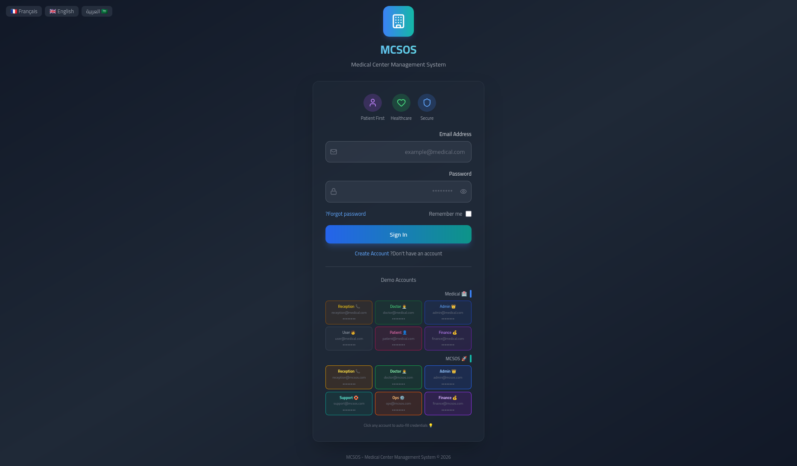
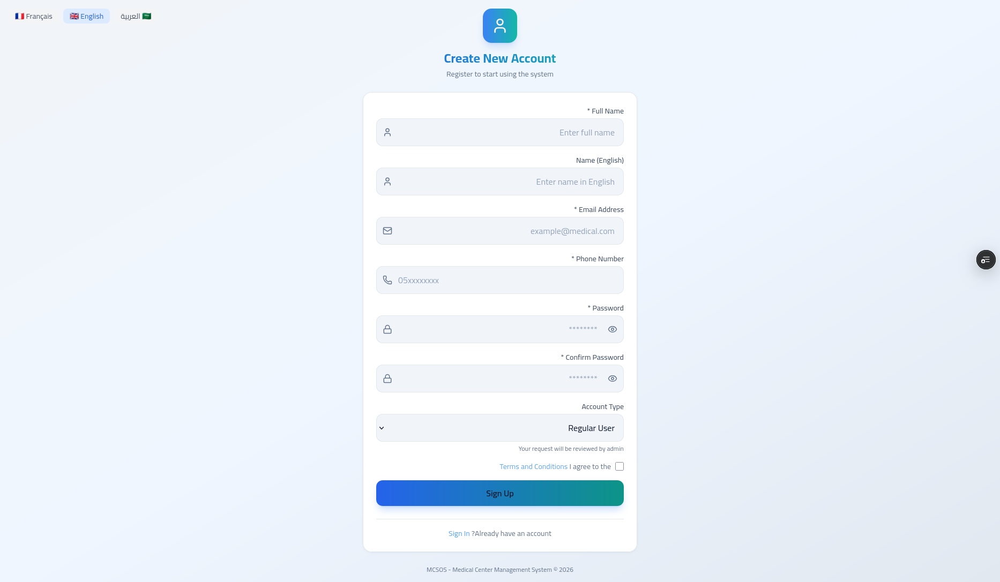
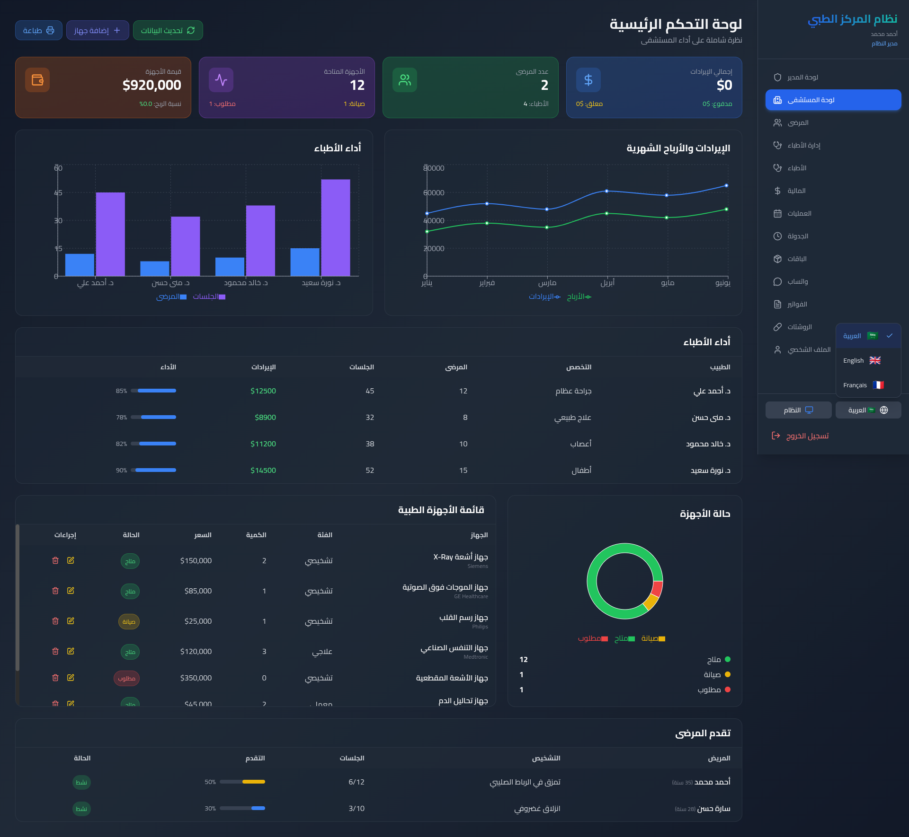
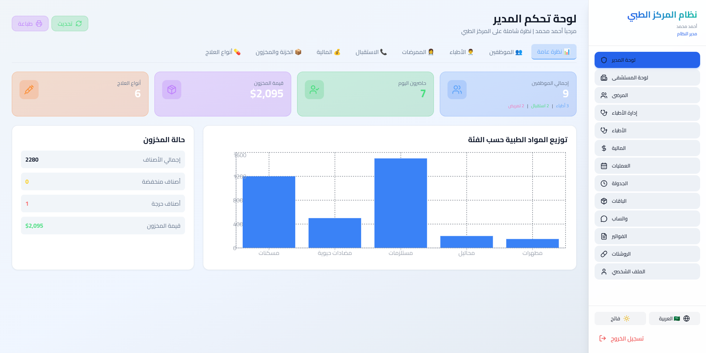
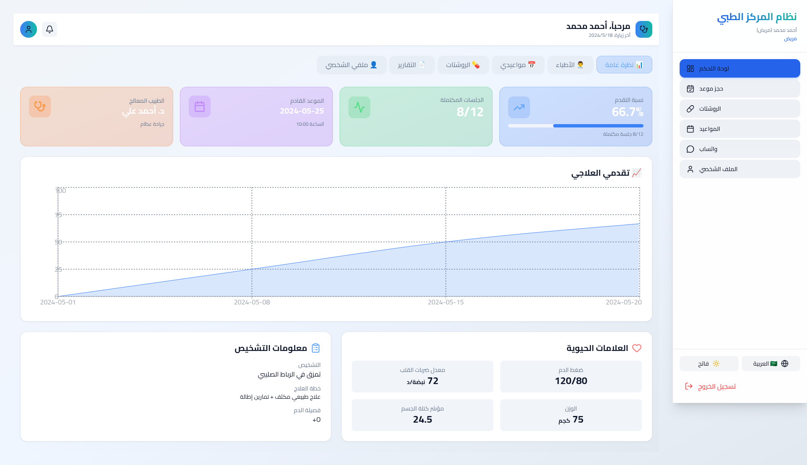

# MCSOS-System — Medical Center Management System

**MCSOS-System** is a Medical Center Management System designed to help organize and manage key information and workflows in a medical center in a clean, modern, and user-friendly way.

This project is built as a front-end application and currently includes an authentication flow (Login) that leads users to the system interface.

---

## Live Demo

You can try the live app here:

**Live Server:**  
`https://mcsos-system.vercel.app/login`

---

## Features

- Login page to access the system dashboard.
- Modern UI built with a component-friendly structure.
- Easy to extend for additional modules (e.g., patients, appointments, services, staff).

*(If you add more modules later, you can update this section to reflect them.)*

---

## Tech Stack

- **React** (Front-end UI)
- **Vite** (Development & build tooling)
- **Tailwind CSS** (Styling)
- **JavaScript** (Project language)
- **ESLint** (Code quality & linting)
- **PostCSS** (CSS tooling)

---

## Project Structure

- `src/` — React application source code
- `index.html` — Main HTML entry
- `vite.config.js` — Vite configuration
- `eslint.config.js` — ESLint configuration

---

## Installation & Setup

```bash
# 1) Clone the repository
git clone https://github.com/Islam412/MCSOS-System.git

# 2) Go into the project folder
cd MCSOS-System

# 3) Install dependencies
npm install

# 4) Run the dev server
npm run dev

- Then open the local URL shown in your terminal (typically http://localhost:5173).

```


## Screenshots

### Login Page
- 

- 

### Dashboard / Main UI
- Admin Dashboard Hospital
- 

- Admin Dashboard
- 

- Admin Dashboard
- 