# MCSOS-System — Medical Center Management System

## 📋 Table of Contents
- [Overview](#overview)
- [Live Demo & Links](#live-demo--links)
- [Features](#features)
- [Role-Based Dashboards](#role-based-dashboards)
- [Screenshots & Documentation](#screenshots--documentation)
- [Tech Stack](#tech-stack)
- [Project Structure](#project-structure)
- [API Integration](#api-integration)
- [Installation & Setup](#installation--setup)
- [Demo Accounts](#demo-accounts)
- [Contributors](#contributors)
- [License](#license)
- [Contact & Support](#contact--support)

---

## Overview
**MCSOS-System** is a comprehensive Medical Center Management System designed to streamline operations in medical facilities. It provides role-based access for administrators, doctors, receptionists, finance personnel, and patients, offering a complete suite of tools for managing patients, appointments, finances, prescriptions, and more.

### Key Highlights
* 🔐 **Secure Authentication** with role-based access control
* 🏥 **5 Role-Specific Dashboards** (Admin, Doctor, Reception, Finance, Patient)
* 🌙 **Dark/Light Theme** support
* 🌍 **Multi-Language support** (Arabic, English, French)
* 📱 **WhatsApp Integration** for automated patient communication
* 📊 **Real-time Statistics** and reporting
* 💾 **Offline Support** with localStorage fallback

---

## Live Demo & Links

| Type | Link |
| :--- | :--- |
| **Live Demo** | [https://mcsos-system.vercel.app/](https://mcsos-system.vercel.app/) |
| **GitHub Repository** | [https://github.com/Islam412/MCSOS-System](https://github.com/Islam412/MCSOS-System) |
| **API Documentation** | [https://medical-center-app-production.up.railway.app/api/docs](https://medical-center-app-production.up.railway.app/api/docs) |

---

## Features

### 🔐 Authentication Module
* **Login Page:** Secure authentication with email/password
* **Registration:** New user account creation
* **Password Recovery:** Reset forgotten passwords
* **Demo Accounts:** 12+ pre-configured accounts for testing
* **Remember Me:** Persistent session support

### 👨‍⚕️ Doctors Management
* **CRUD Operations:** Create, Read, Update, Delete doctors
* **Availability Management:** Set working days and hours
* **Specialty Management:** Categorize by medical specialty
* **Rating System:** Patient reviews and ratings
* **Slot Management:** Create and manage appointment slots

### 📋 Patients Management
* **Patient Registration:** Add new patients with complete medical history
* **Patient Search:** Search by name, phone, or ID
* **Medical Profile:** View complete patient medical records
* **Treatment Progress:** Track patient treatment progress
* **Document Management:** Upload and manage medical documents

### 📅 Appointment Scheduling
* **Book Appointments:** Schedule appointments with doctors
* **Availability Checking:** View doctor availability in real-time
* **Bulk Scheduling:** Create multiple appointments at once
* **Dynamic Scheduling:** Flexible appointment creation
* **Appointment History:** View past and upcoming appointments

### 💰 Finance Module
* **Invoice Management:** Create, update, and track invoices
* **Payment Processing:** Mark invoices as paid
* **Financial Reports:** Daily and monthly financial summaries
* **Revenue Tracking:** Monitor total revenue and pending payments
* **Package Payments:** Manage package purchases and payments

### 📦 Packages Module
* **Package Creation:** Create service packages with multiple services
* **Service Assignment:** Link services to packages
* **Patient Packages:** Assign packages to patients
* **Session Tracking:** Track package usage and remaining sessions

### 💊 Prescriptions Module
* **Create Prescriptions:** Digital prescriptions with medications
* **Medication Management:** Add multiple medications per prescription
* **Print Prescriptions:** PDF and print support
* **Prescription History:** View all patient prescriptions

### 📱 WhatsApp Integration
* **Message Templates:** Pre-built message templates
* **Automated Flows:** Set up automated messaging workflows
* **Message Scheduling:** Schedule messages for future delivery
* **Contact Management:** Manage patient contacts
* **Message History:** View all sent messages

### 👤 Profile Management
* **Profile Editing:** Update personal information
* **Avatar Upload:** Change profile picture
* **Password Change:** Secure password updates
* **Theme Preferences:** Dark/Light/System theme selection
* **Language Preferences:** Switch between Arabic, English, French

---

## Role-Based Dashboards

### 🛡️ Admin Dashboard
Full system administration with comprehensive overview
* **Overview Statistics:** Total patients, doctors, appointments, revenue
* **Employee Management:** View all staff (doctors, nurses, reception, finance)
* **Inventory Management:** Track medical supplies and equipment
* **Treatment Types:** Manage available treatments and services
* **Revenue Charts:** Visual representation of monthly revenue
* **Stock Monitoring:** Track inventory levels and alerts

### 🏥 Hospital Dashboard
Comprehensive hospital-wide overview
* **Key Metrics:** Total patients, doctors, appointments, revenue
* **Revenue Analytics:** Monthly revenue and profit charts
* **Doctor Performance:** Track doctor utilization and performance
* **Medical Devices:** Manage hospital equipment inventory
* **Patient Progress:** Monitor patient treatment progress
* **Appointment Statistics:** Today's appointments and completion rates

### 👨‍⚕️ Doctor Dashboard
Personalized dashboard for healthcare providers
* **Today's Schedule:** View daily appointments
* **Patient Check-in:** Mark patient attendance
* **Recent Patients:** Quick access to recent patients
* **Prescription Creation:** Write new prescriptions
* **Statistics:** Completed sessions, total patients, today's patients
* **Performance Metrics:** Rating and completion tracking

### 📞 Reception Dashboard
Appointment and patient management hub
* **Patient Registration:** Quick patient registration
* **Appointment Booking:** Book appointments with doctors
* **Patient Search:** Find patients by name or phone
* **Check-in Management:** Track patient attendance
* **Daily Report:** Generate daily activity reports
* **Recent Registrations:** View recently registered patients

### 👤 Patient Dashboard
Patient-centric portal
* **Overview:** Treatment progress and upcoming appointments
* **Book Appointment:** Self-service appointment booking
* **My Appointments:** View past and upcoming appointments
* **Prescriptions:** Access all medical prescriptions
* **Medical Reports:** View and download reports
* **Profile:** Update personal information

---

## Screenshots & Documentation

### 🔐 Authentication
| Page | Image | Description |
| :--- | :---: | :--- |
| **Login Page** |  | Secure login with email/password, demo accounts section, and multi-language support |
| **Register Page** 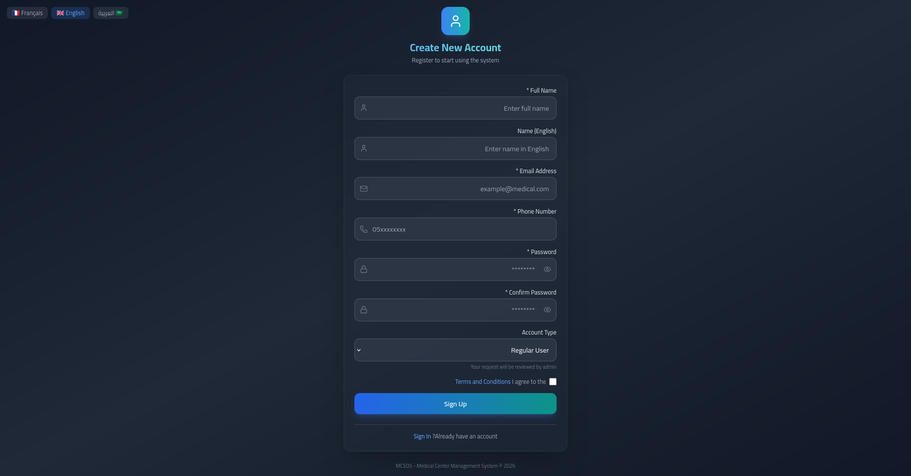 | New user registration with role selection and password strength indicator |
| **Forgot Password** 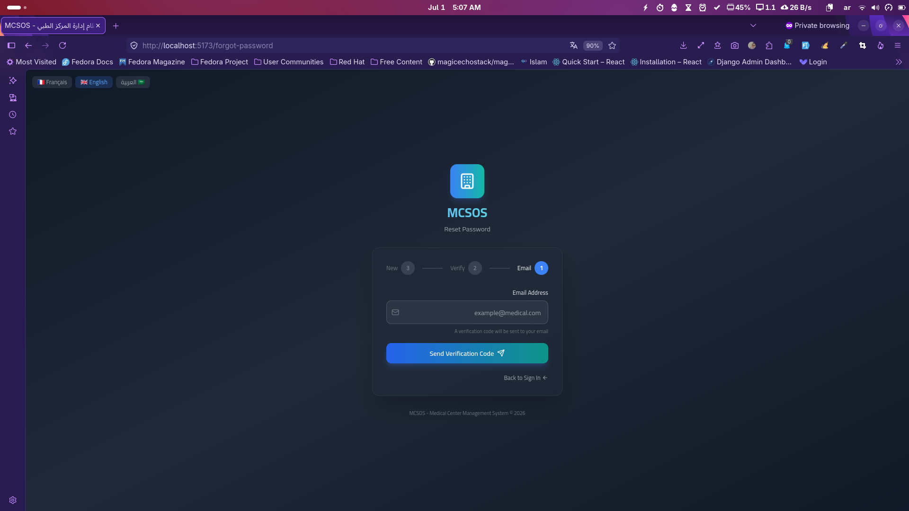 | Password recovery with verification code |

### 🏥 Dashboards
| Page | Image | Description |
| :--- | :---: | :--- |
| **Admin Dashboard (Dark)** |  | Complete system overview with statistics, employee management, inventory, and revenue charts |
| **Admin Dashboard (Light)** | 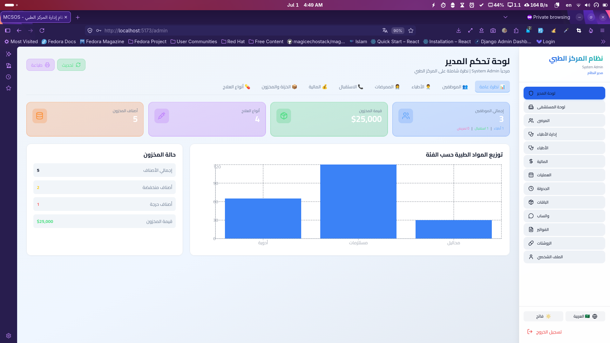 | Light theme view of the system administrator dashboard |
| **Hospital Dashboard** | 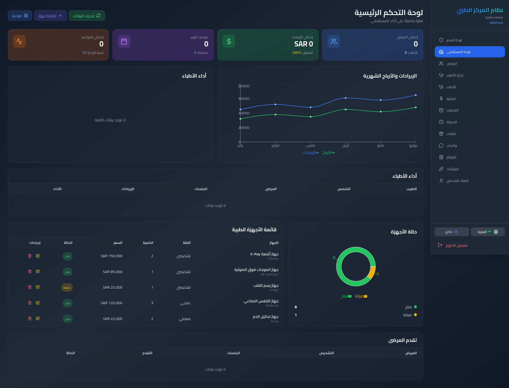 | Hospital-wide metrics, revenue analytics, doctor performance, and device management |
| **Doctor Dashboard** | 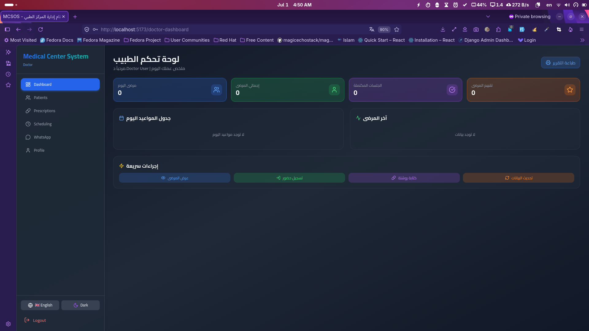 | Today's schedule, patient check-in, recent patients, and prescription creation |
| **Reception Dashboard** | 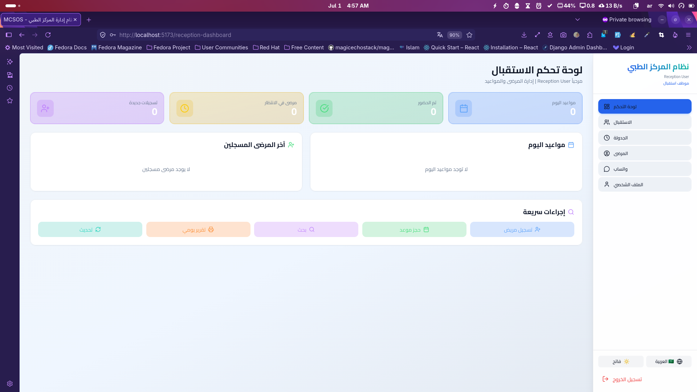 | Patient registration, appointment booking, check-in management, and daily reports |

### 📋 Management Pages
| Page | Image | Description |
| :--- | :---: | :--- |
| **Patients Management** | 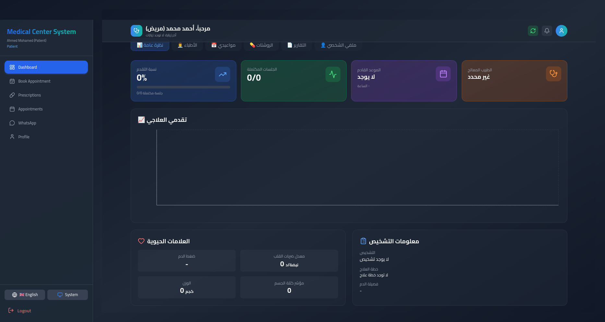 | Full patient CRUD, medical history, treatment progress tracking, and document management |
| **Doctors Manager** |  | Doctor CRUD, availability management, specialty categorization, and rating display |
| **Finance Manager** | 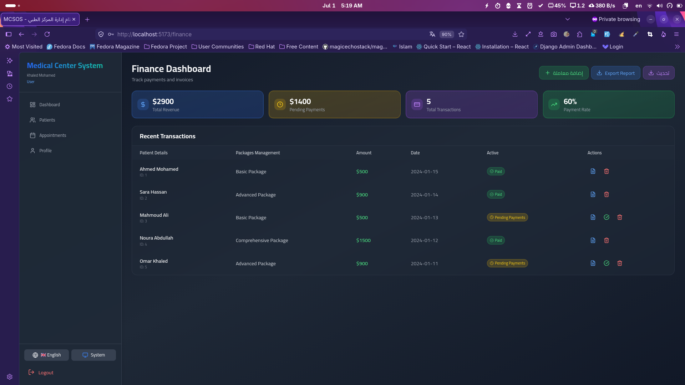 | Invoice creation, payment processing, financial reports, and revenue tracking |
| **Packages Manager** | 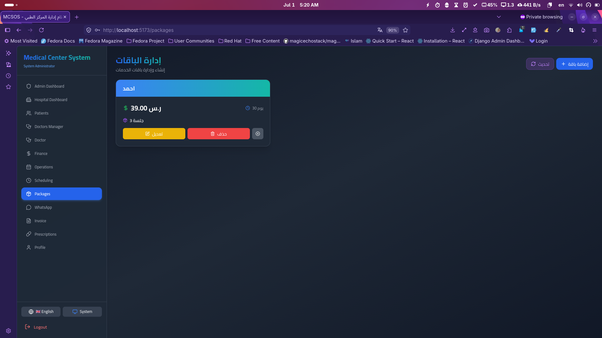 | Service package creation, service assignment, patient package management |
| **Scheduling** | 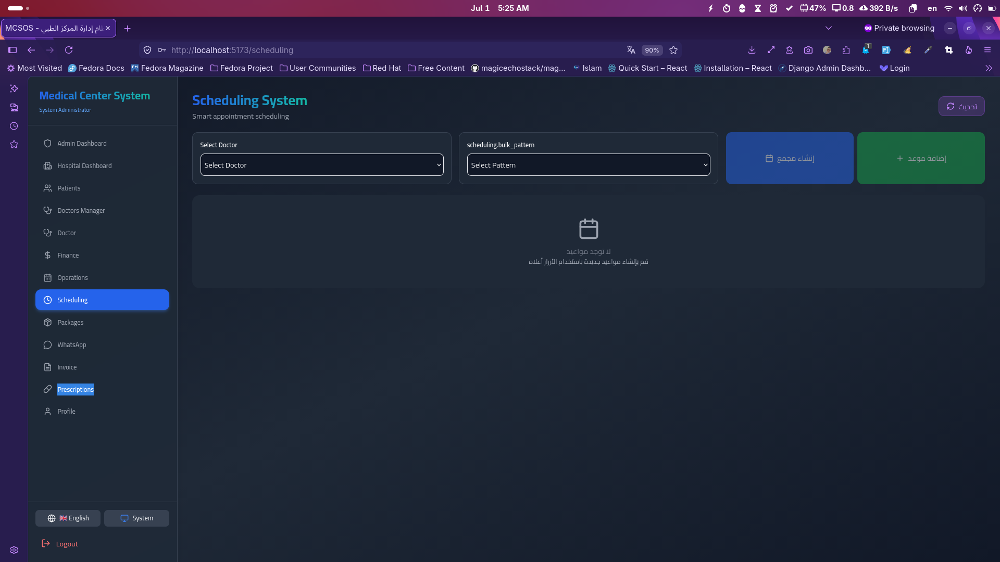 | Appointment booking, availability checking, bulk and dynamic scheduling |
| **Booking** | 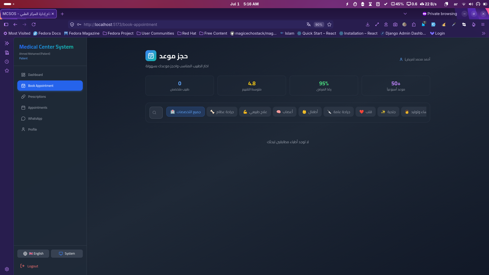 | Appointment booking, availability checking, bulk and dynamic scheduling |
| **Prescriptions** | 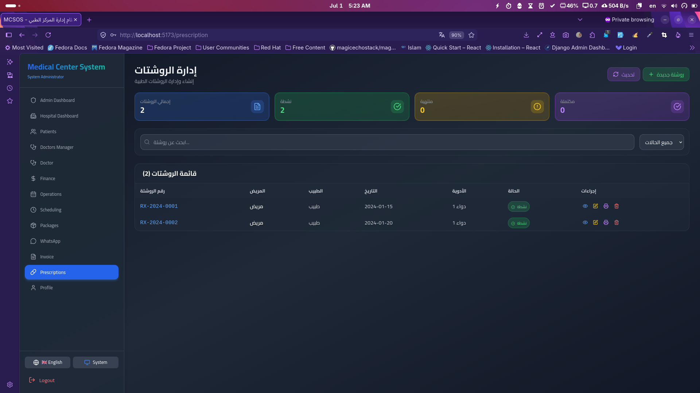 | Digital prescription creation, medication management, printing support |

### 📱 Communication
| Page | Image | Description |
| :--- | :---: | :--- |
| **WhatsApp Manager** | 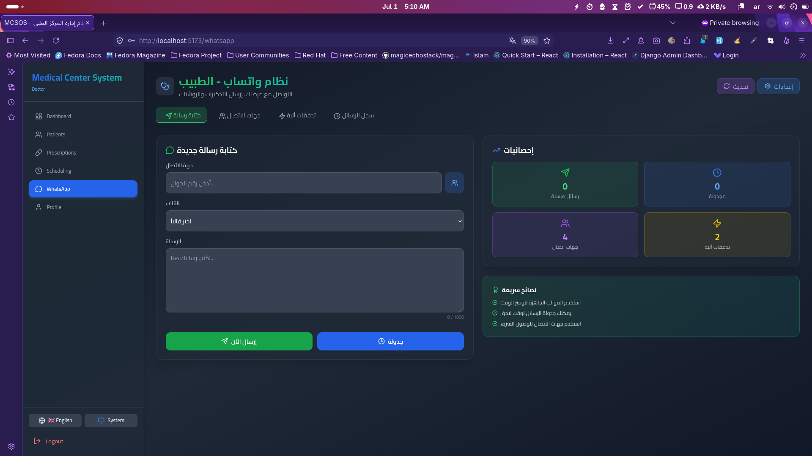 | Message templates, automated flows, message scheduling, and contact management |

### 👤 User Management
| Page | Image | Description |
| :--- | :---: | :--- |
| **Profile** | 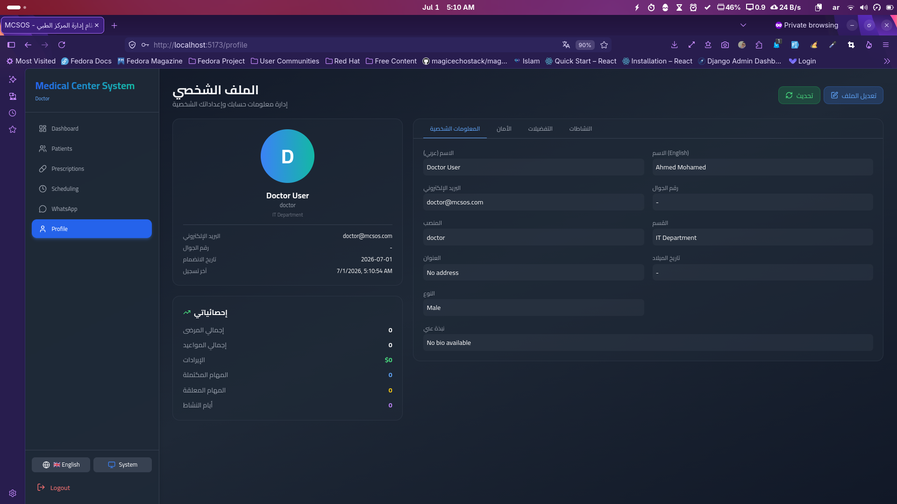 | Personal information editing, avatar upload, password change, theme preferences |
---

## Tech Stack

| Technology | Usage |
| :--- | :--- |
| **React 19** | UI Building |
| **Vite** | Development & Build Tool |
| **Tailwind CSS** | Styling |
| **React Router DOM** | Routing |
| **React i18next** | Multi-language (Ar/En/Fr) |
| **Recharts** | Charts & Statistics |
| **Lucide React** | Icons |
| **React Hot Toast** | Notifications |

---

## Project Structure

```text
MCSOS-System/
├── src/
│   ├── components/          # Reusable components
│   │   ├── admin/           # Admin components (DoctorsManager, UsersManager)
│   │   ├── common/          # Shared components (DashboardLayout, ProtectedRoute)
│   │   ├── finance/         # Finance components (FinanceManager)
│   │   ├── invoice/         # Invoice components (InvoiceManager)
│   │   ├── packages/        # Packages components (PackagesManager)
│   │   ├── prescription/    # Prescription components (PrescriptionManager)
│   │   ├── reception/       # Reception components (PatientRegistration, PatientSearch)
│   │   ├── scheduling/      # Scheduling components (SchedulingEngine)
│   │   └── whatsapp/        # WhatsApp components (WhatsAppManager)
│   ├── context/             # React Context
│   │   ├── ThemeContext.jsx
│   │   ├── ServiceContext.jsx
│   │   └── ...
│   ├── pages/               # Main pages
│   │   ├── auth/            # Authentication (Login, Register, ForgotPassword)
│   │   ├── dashboard/       # Dashboards (Admin, Hospital, Doctor, Reception, Patient)
│   │   ├── patient/         # Patient pages (Appointments, BookAppointment, PatientProfile)
│   │   └── profile/         # User profile (Profile)
│   ├── services/            # API services
│   │   └── api/
│   │       ├── services/    # Service implementations
│   │       ├── client.js    # API client with token management
│   │       ├── config.js    # API configuration
│   │       └── index.js     # Service exports
│   ├── i18n.js              # i18n configuration
│   ├── index.css            # Main CSS with Tailwind
│   └── main.jsx             # Entry point
├── index.html               # Main HTML template
├── package.json             # Dependencies
├── vite.config.js           # Vite configuration
└── tailwind.config.cjs      # Tailwind configuration

## API Integration

### Base URL
```text
    [https://medical-center-app-production.up.railway.app](https://medical-center-app-production.up.railway.app)
```

## Authentication

### All API requests require a Bearer token in the Authorization header:
```text
    Authorization: Bearer <your_token>
```

### Main Endpoints

| Service | Endpoint | Method | Description |
| :--- | :--- | :--- | :--- |
| **Auth Login** | `/api/v1/auth/login` | `POST` | Authenticate user |
| **Auth Register** | `/api/v1/auth/register` | `POST` | Register new user |
| **Users** | `/api/v1/users` | `GET/POST` | Manage users |
| **Doctors** | `/api/v1/doctors` | `GET/POST` | Manage doctors |
| **Patients** | `/api/v1/patients` | `GET/POST` | Manage patients |
| **Appointments** | `/api/v1/sessions` | `GET/POST` | Manage appointments |
| **Packages** | `/api/v1/packages` | `GET/POST` | Manage packages |
| **Invoices** | `/api/v1/finance/invoices` | `GET/POST` | Manage invoices |
| **Prescriptions** | `/api/v1/prescriptions` | `GET/POST` | Manage prescriptions |
| **WhatsApp** | `/api/v1/whatsapp/*` | `Various` | WhatsApp integration |

---

### Offline Support
The system includes `localStorage` fallback for offline operation:

* **ServiceContext:** Manages online/offline state
* **Data Sync:** Automatic sync when reconnecting
* **Local Cache:** All data is cached in `localStorage`

---

## Installation & Setup

### Prerequisites
* Node.js 18+ or 20+
* npm or yarn

### 1. Clone the Repository
```bash
    git clone [https://github.com/Islam412/MCSOS-System.git](https://github.com/Islam412/MCSOS-System.git)
    cd MCSOS-System
```

### 2. Install Dependencies
```bash
    npm install
```

### 3. Run Development Server
```bash
    npm run dev
``` 

### Then open: http://localhost:5173
### 4. Build for Production
```bash
    npm run build
```

### 5. Preview Production Build
```bash
    npm run preview
```

### Environment Variables (Optional)
### Create a .env file in the root directory:
```txt

    Code snippet

    VITE_API_BASE_URL=[https://medical-center-app-production.up.railway.app](https://medical-center-app-production.up.railway.app)
```

## Demo Accounts

### 🏥 Medical Accounts
| Email | Password | Role | Dashboard |
| :--- | :--- | :--- | :--- |
| admin@medical.com | admin123 | System Admin | Admin Dashboard |
| doctor@medical.com | doctor123 | Doctor | Doctor Dashboard |
| reception@medical.com | reception123 | Receptionist | Reception Dashboard |
| finance@medical.com | finance123 | Finance | Finance Manager |
| patient@medical.com | patient123 | Patient | Patient Dashboard |
| user@medical.com | user123 | User | Patient Dashboard |

### 🚀 MCSOS Accounts
| Email | Password | Role | Dashboard |
| :--- | :--- | :--- | :--- |
| admin@mcsos.com | password123 | System Admin | Admin Dashboard |
| doctor@mcsos.com | password123 | Doctor | Doctor Dashboard |
| reception@mcsos.com | password123 | Receptionist | Reception Dashboard |
| finance@mcsos.com | password123 | Finance | Finance Manager |
| ops@mcsos.com | password123 | Operations | Admin Dashboard |
| support@mcsos.com | password123 | Support | Patient Dashboard |

---

## Contributors

| Contributor | Role | GitHub |
| :--- | :--- | :--- |
| **Islam Hamdy** | Lead Developer | [@Islam412](https://github.com/Islam412) |
| **Hassan Salah** | Contributor | [@HassanSalah1](https://github.com/HassanSalah1) |

---

## 📄 License
This project is open-source and freely available for use.

---

## 📞 Contact & Support
* **GitHub Issues:** [Report an issue](https://github.com/Islam412/MCSOS-System/issues)
* **Live Demo:** [https://mcsos-system.vercel.app/](https://mcsos-system.vercel.app/)
* **Repository:** [https://github.com/Islam412/MCSOS-System](https://github.com/Islam412/MCSOS-System)

---
**MCSOS System — Complete Medical Center Management Solution 🏥✨**